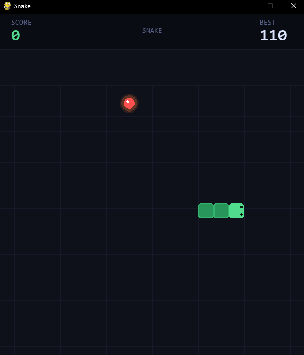
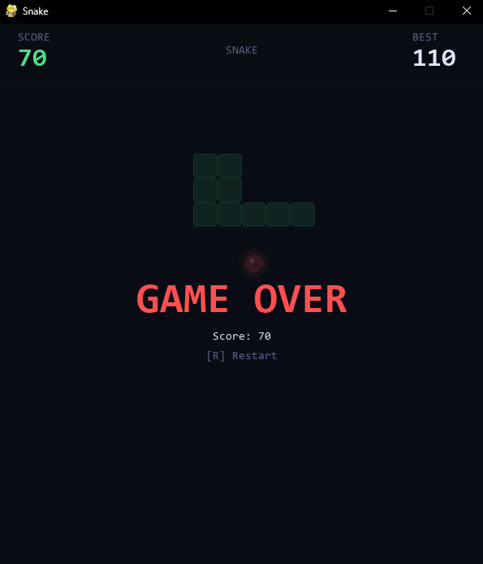

# 🐍 Snake Game

A polished Snake game built with Python and Pygame.
This project recreates the classic arcade Snake experience with smooth movement, a high score system, and a clean retro-inspired design.

## 🎮 Play the Game

Download and play the Windows version from itch.io:

➡ https://fafaog.itch.io/snake-game

Download the ZIP file

Extract the archive

Run SnakeGame.exe

No additional installation is required.

## 🖼 Screenshots
### Start screen


### Game Over


## Setup

```bash
pip install -r requirements.txt
python main.py
```

## 🎮 Controls

| Key | Action |
|-----|--------|
| `↑ ↓ ← →` or `W A S D` | Move snake |
| `R` / `Space` / `Enter` | Restart after game over |

##  ✨ Features

- **High score tracker** — persisted to `highscore.json` between sessions
- Pulsing food with glow effect
- Smooth snake rendering with directional eyes
- Death flash animation
- Score panel with current score and best score

## ▶ Run From Source

If you want to run the game from the Python source code:

pip install -r requirements.txt
python main.py

## Project Structure

```
snake-game/
├── main.py          # Game loop, rendering, state management
├── snake.py         # Snake class (movement, collision, drawing)
├── food.py          # Food class (spawning, pulse animation)
├── requirements.txt
└── README.md
```

## 🛠 Built With

- Python
- Pygame

## 📜 License

This project is open source and available under the MIT License.
